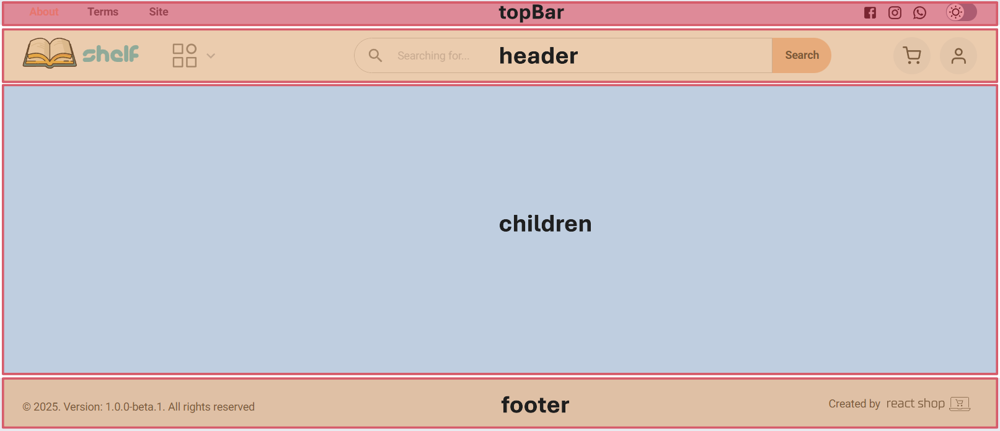

# Layout

The ``Layout`` component provides a flexible way to customize your site's layout using composition. Each part of the layout can be customized or replaced with your own components, making it highly adaptable.

If you want complete control, you can create your own layout component from scratch. However, if you only need to modify the default layout, the ``Layout`` component offers an easy way to do so.



### Usage

Create a custom layout overriding some of the props of the default layout.

```jsx title="Example"
import type { FC, PropsWithChildren } from 'react';
import { ShopClient } from 'react-shop';
import { Layout } from 'react-shop-mui/Layout';
import { MyHeader } from './MyHeader';

const StoreLayout = ({ children }: PropsWithChildren) => {
  return (
    <Layout header={<MyHeader />}>
      {children}
    </Layout>
  );
};

const StoreFront: FC<PropsWithChildren> = ({ children }) => (
  <ShopClient layout={StoreLayout}>
    {children}
  </ShopClient>
);
```

:::warning
Remember to pass down the ``children`` prop in your Layout component. 
:::

### Props

All props received by the ``Layout`` component, except ``children``, are optional.

| Prop | Type | Description
| --- | --- | --- |
| **children**  | ``ReactNode`` | Content rendered inside the layout.
| **topBar**  | ``ReactNode`` | A React component rendered at the top of the layout. Can be used for announcements or promotions.
| **header**  | ``Element`` or ``Component`` | The main header of the site. Can be a component or a React element.
| **menu**  | ``ReactNode`` | Optional component for rendering a navigation menu.
| **footer**  | ``Element`` or ``Component`` | The main footer of the site. Can be a component or a React element.
| **scrollTop**  | ``Component`` | A small button that appears at the bottom-right corner. When clicked, it scrolls the page to the top
| **cookieBar**  | ``Component`` | Component for displaying cookie consent information.
| **cart**  | ``Element`` or ``false`` | Dialog component for the shopping cart. Set to false if you prefer a separate cart page
| **auth**  | ``Element`` or ``false`` | Dialog component for authentication. Set to false if you prefer dedicated authentication pages
| **sx**  | ``SxProps`` | Style object for customizing layout appearance, powered by MUI System

### noLayout

If you need to create pages that skip the ``Layout`` component you can create a route group called **(noLayout)** inside your *app* directory. Pages within this folder will not inherit the default layout.

```bash
my-website
|── src
|   ├── app
|     ├── [locale]
|       ├── about.tsx ## Uses Layout
|       ├── (noLayout)
|         ├── terms.tsx ## Skips default Layout
```